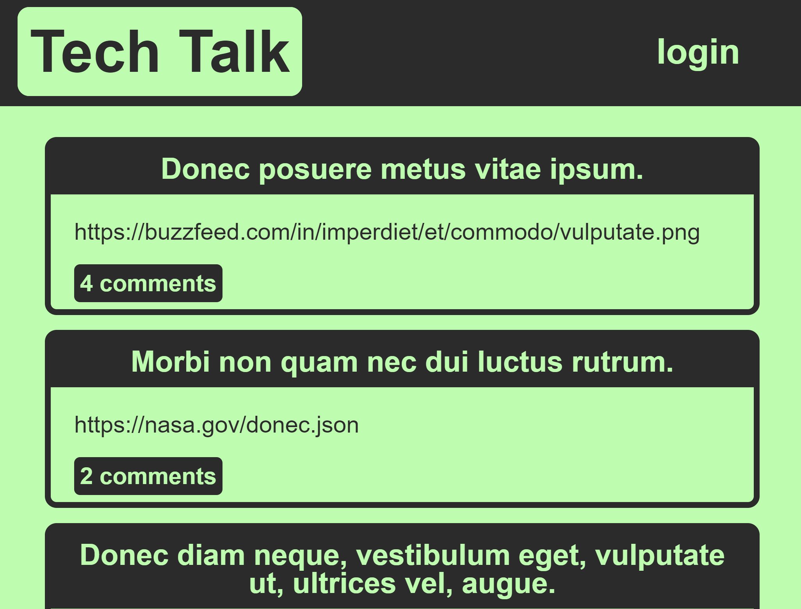
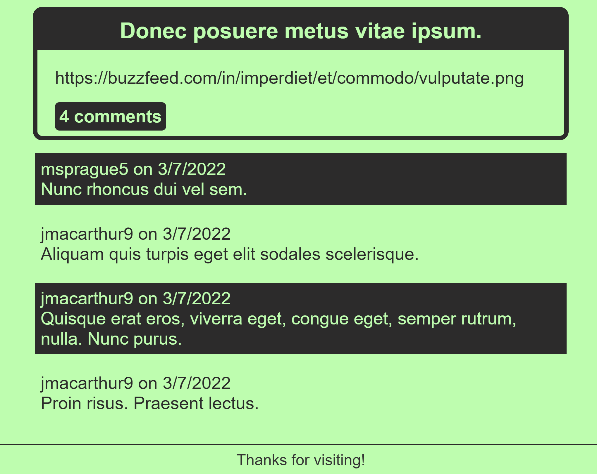

  # Tech Talk
  [](https://opensource.org/licenses/MIT)

  ## Table of Contents:

  ---
  * [Description](#description)
  * [Installation](#installation)  
  * [Usage](#usage)  
  * [Credits](#credits)    
  * [Tests](#tests)  
  * [Questions](#questions)  

  ## Description

  ---
  This is a tech forum where users can post new tech news or messages about code or anything tech related and other users can comment on this post to give feedback. To post or comment the user must create an account or log in to their account but not logged in users still have the ability to read posts and comments.

  ## Installation:

  ---
  To install all necessary dependencies for this program,
  open the console and run the following command:  
  ```npm i```

  ## Usage

  ---
  The usage is a full CRUD deployment of an application to heroku with users that log in and have encrypted passwords. Users can create, edit and delete posts, and create comments.

  ### Homepage Image
  

  ### Comments page Image
  

  ## Assets and Libraries

  ---
  - mysql
  - Heroku
  - Express
  - dotenv
  - bcrypt
  - handlebars
  - node
  - sequelize

  ## Tests

  ---
  To test this application run this command in the console:  
  ```npm run seeds, npm start```

  ## Questions

  ---
  For any questions feel free to reach out through the following contacts:  

  Email: jacob.tobin.liberty@gmail.com  
  Github: https://github.com/JacobGit3  
  